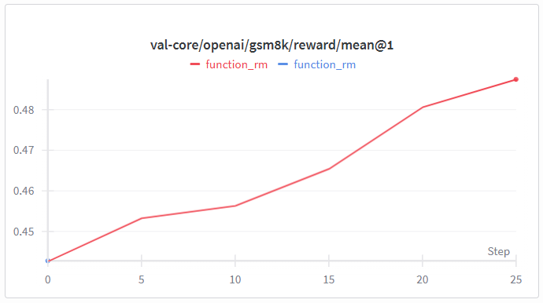

# verl-trainingWithoutRollout

#### step 0 

prepare verl enviroment.

git clone this repo

#### step1

prepare `gsm8k`dateset

```sh
cd verl
python examples/data_preprocess/gsm8k.py
```

#### step2

use vllm to collect rollout data

```sh
python verl/trainer/vllm_rollout.py
```

#### step3

training without rollout

```sh
bash grpo_gsm8k_withoutrollout.sh
```


## 🧩 Experimental Results

#### Figure 1. Training with rollout


#### Figure 2. Training without rollout


#### Figure 3.Training without rollout

rollout data collect from fig4,rm_fn not same with fig1&fig2 


#### Figure 4.Training with rollout


